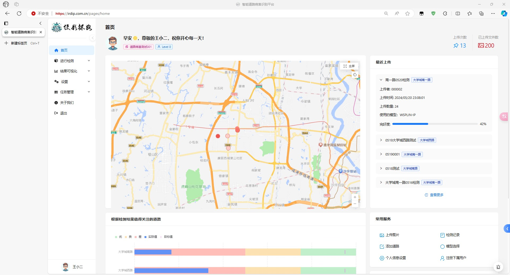
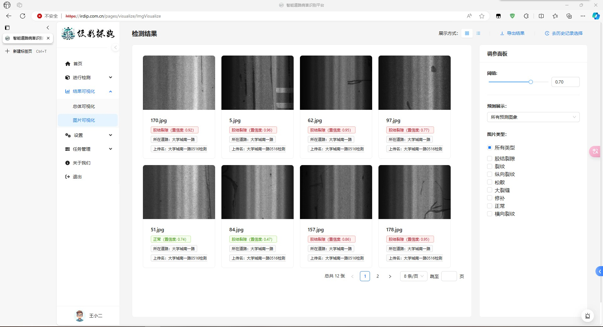

# 纹影探路-智能道路病害分析平台

<div align="center">
  <a   					href="https://github.com/FangHeng/Intelligent_Road_Distress_Identification_Platform_Web"></a>
  &nbsp;&nbsp;&nbsp;
  <a href="https://github.com/FangHeng/Intelligent_Road_Distress_Identification_Platform_Web"></a>
  &nbsp;&nbsp;&nbsp;
  <a href="https://github.com/FangHeng/Intelligent_Road_Distress_Identification_Platform_Web"></a>
</div>


🛣️ **纹影探路**是一个创新的工业软件平台，旨在通过先进的深度学习技术，提供精确的道路病害检测和分析。它能自动识别道路裂缝、修补等常见问题，并生成详尽的状况报告，极大地提升道路维护的效率和准确性。

我们的目标是让深度学习对工业路面病害检测技术对每个人都更加开放和易用，纹影探路具有以下几个特点：

- 🧪 精准 - 对道路状况进行细致的分析和检测。根据模型训练的标签，将检测结果进行细化，方便用户查看。
- 🛠️ 道路管理更方便 - 开启道路维护的新方式。使用平台管理路面信息，更好地维护道路，提高管理效率。
- 🤝 自动化 - 让纹影探路为您工作，将您的想法变为现实。内置AI助手，方便用户与平台进行交流，提供更好的使用体验。大模型助力报告生成，提供更加精细的报告内容。

加入我们的行列！纹影探路将持续引领深度学习技术在道路维护领域的创新。

## 运行界面





更完整的功能演示视频请参考：[智能道路病害分析平台功能演示](https://s0sf8djhx3.feishu.cn/file/BPKzbkMZ2oqqpRxkI7ictEULnCc)

项目PPT请参考：[项目PPT](doc/PPT-GitHub.pdf)

## TODO List

- [x] 完善README
- [x] 添加项目的PPT
- [x] 添加项目演示视频
- [ ] 提供更多的演示
- [ ] 代码优化

## 功能特性

- 自动化病害检测与识别：传统的路面病害检测主要依靠人工巡检或简单的设备，效率低下且容易漏检。本平台通过使用一些深度学习模型，高效地自动检测和识别路面病害，如裂缝、坑洼等，并对病害区域做出标记，提高检测效率和精度。
- 病害类型评估：除了检测路面是否存在病害，本平台还可以根据用户上传的路面数据进行具体的病害类别检测，为路面维修和养护提供依据。
- 应用大语言模型：平台采用了先进的大语言模型，它能够自动生成详细的道路病害分析报告，并支持交互式的查询和对话，提高了报告的生成效率和准确性，而且极大地优化了用户体验。
- 交互式地图与定位：平台引入了高德地图，用户可以上传道路后可以定位到道路的具体位置，并在道路上查看分析的信息。
- 多维度数据展示与分析：平台可以对用户上传的海量路面图像进行整合、识别和分类，用户可根据自身情况设置阈值，可以导出病害分析结果，为道路建设和养护部门提供决策支持。

## 依赖与工具

- **前端**：
  
  - 使用了 [React](https://reactjs.org/) 构建的应用（基于 create-react-app）。
  - 使用了 [Ant Design](https://ant.design/) 作为 UI 组件库，包括 [Ant Design Pro Components](https://procomponents.ant.design/)，使用了 [AntV](https://antv.antgroup.com/) 作为可视化图表。
  - 使用了 [React Router](https://reactrouter.com/) 进行导航。
- **后端**：
  
  - 使用了 [Django](https://www.djangoproject.com/) 进行管理。
  - 部署了多个深度学习模型，包括：
    - [Swin Transformer](https://github.com/microsoft/Swin-Transformer)
    - [PicT](https://github.com/DearCaat/PicT)
    - [WSPLIN-SS](https://github.com/DearCaat/WSPLIN)
    - [WSPLIN-IP](https://github.com/DearCaat/WSPLIN)
  - 使用了 [MySQL](https://www.mysql.com/) 作为后端数据库。
  - 使用了 [MinIO](https://min.io/) 作为文件服务器。
  - 使用了 [Redis](https://redis.io/) 作为缓存机制。
- ### 容器化与部署
  
  - 容器化
    - 整个应用被封装在 [Docker](https://www.docker.com/) 中。
  - 管理工具
    - 使用 Docker Compose 统一管理容器化应用。

## 构建与运行

### 环境准备

在运行项目之前，请确保你的系统已经安装了以下环境：

- [Docker](https://www.docker.com/)：用于容器化应用程序的开源平台。
- [Docker Compose](https://docs.docker.com/compose/)：用于定义和运行多个 Docker 容器应用程序的工具。

如果尚未安装 Docker 和 Docker Compose，请根据官方文档进行安装和查看使用。

### 部署

1. 克隆项目仓库到本地：

   ```bash
   git clone https://github.com/FangHeng/Intelligent_Road_Distress_Identification_Platform_Web.git
   ```

2. 进入项目目录：

   ```bash
   cd Intelligent_Road_Distress_Identification_Platform_Web
   ```

### 配置

#### 配置环境变量

1. 在根目录下复制 `.env.example` 文件，并命名为 `.env`：

   ```bash
   cp .env.example .env
   ```

2. 编辑 `.env` 文件，根据项目需求设置环境变量的值。

3. 如果你在运行 `homepage` 或 `frontend` 时发现环境变量未能成功加载，请在相应目录下创建并编辑对应的 `.env` 文件。

### 配置 SSL 证书和 nginx

1. 在项目根目录下创建 `frontend/ssl` 文件夹：

   ```bash
   mkdir -p frontend/ssl
   ```

2. 将 SSL 证书和密钥文件复制到 `frontend/ssl` 文件夹中。可以使用以下命令将证书和密钥文件复制到目标文件夹：

   ```bash
   cp /path/to/your/certificate.crt /path/to/your/private.key frontend/ssl/
   ```

   请将 `/path/to/your/certificate.crt` 和 `/path/to/your/private.key` 替换为实际的证书和密钥文件的路径。

3. 编辑 `frontend/nginx.conf` 文件，确保配置文件正确指向证书和密钥文件。需要根据实际的证书文件名来更新配置文件中的路径。

### 启动项目

运行以下命令启动项目：

```bash
docker compose up --build
```

## 贡献

我们欢迎并感谢您对该项目的贡献！如果您有任何建议、bug 报告或者想要参与项目的开发，请通过以下方式进行贡献：

1. Fork 本仓库
2. 创建您的特性分支 (`git checkout -b feature/AmazingFeature`)
3. 提交您的修改 (`git commit -m 'Add some AmazingFeature'`)
4. 将您的修改推送到分支 (`git push origin feature/AmazingFeature`)
5. 提交 Pull Request

## 许可证

该项目采用 Apache-2.0 许可证 - 请参阅 [LICENSE](LICENSE) 文件了解更多信息。

## 贡献者

感谢以下贡献者：

- [Fangheng (方珩)](https://github.com/FangHeng)
- [Mr-lander (嵇禄)](https://github.com/Mr-lander)
- [HJingCheng (rui huang)](https://github.com/HJingCheng)
- [DearCaat (Wenhao Tang)](https://github.com/DearCaat)

## 致谢

在此，谨向重庆大学大数据与软件学院的[黄晟](http://www.cse.cqu.edu.cn/info/2095/7375.htm)教授致以诚挚的感谢。感谢黄教授在项目开发过程中给予的宝贵帮助和支持，使我们能够顺利完成本开源项目。

---

更多我们团队关于道路病害分类的任务可以参考：[Pavement-Distress-Classification](https://github.com/DearCaat/Pavement-Distress-Classification)

如果您对我们的项目感兴趣，欢迎邮件联系：[Email](mailto:fangheng@cqu.edu.cn)

